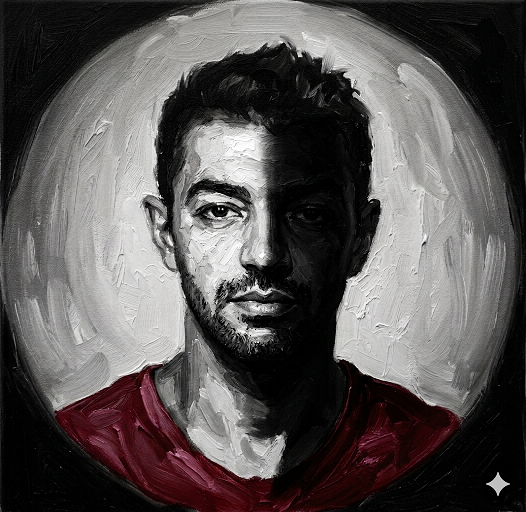

+++
title = "Running more"
date = 2026-05-12
[taxonomies]
categories=["Inferences"]
tags=["Inference", "English", "Life", "Stoic"]
+++
---
 

## (*Eng*) Runnning more
Seems like most of the pains was because of a broken promise. 

I had to run more but ignored, wasted, rested, slept, etc. 

I made it harder to run, harder to enjoy.

Then lost myself.

Now I see running is the thing will bring me back.

One more time, I will live.

As I used to.

